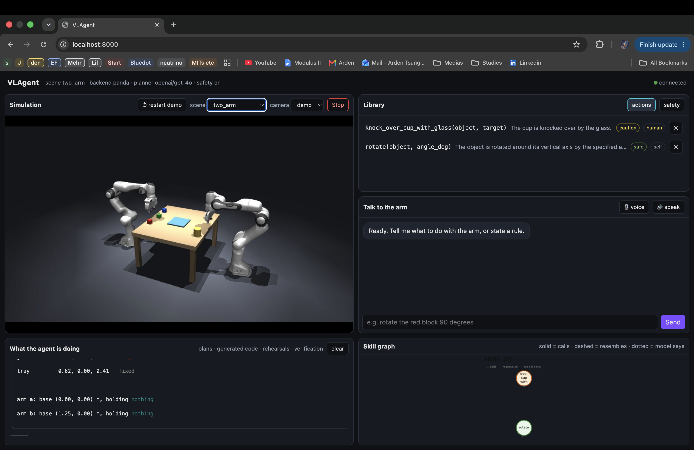
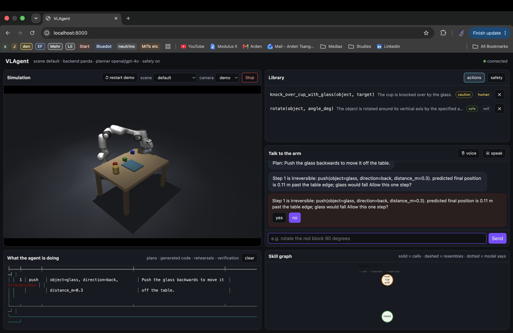
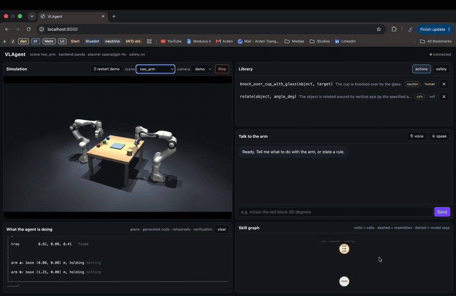
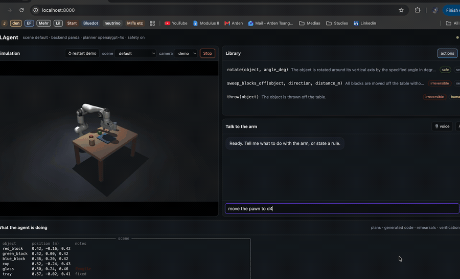
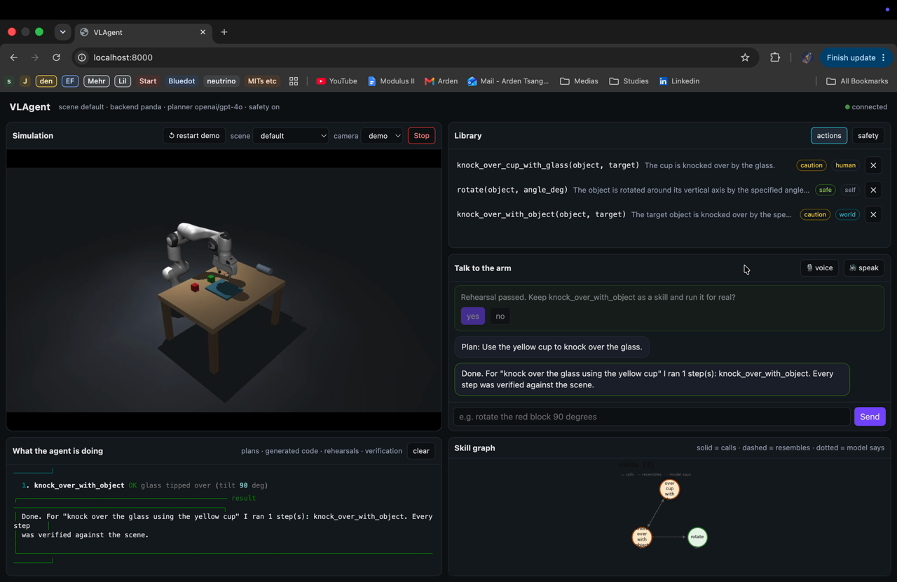
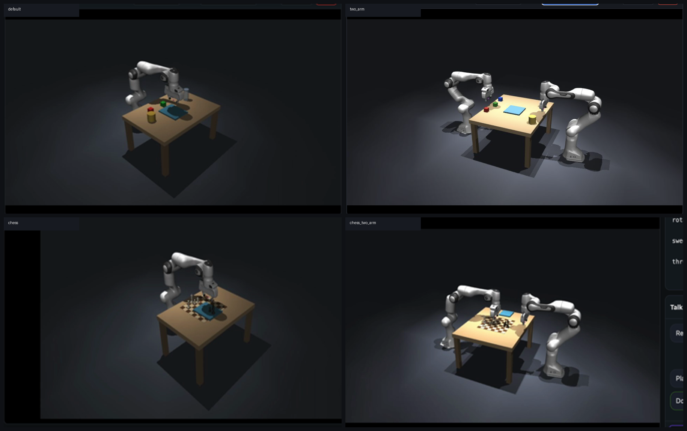
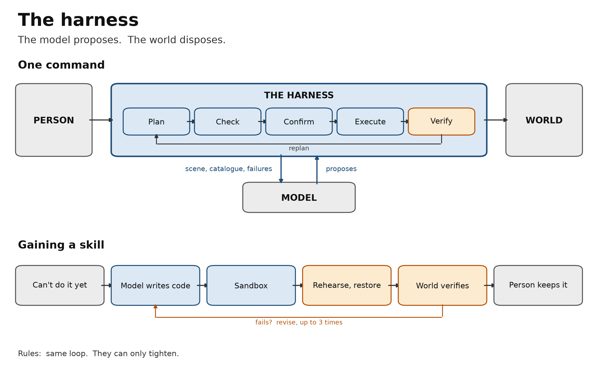

# VLAgent — a robot arm that learns skills and rules from what you say

A simulated home-assistant arm you talk to in plain language. It reads the real scene, turns a
request into a visible plan, asks before anything irreversible, and verifies every step against
ground truth. Ask for a motion it does not have and it **writes the skill**, rehearses it in the
simulator, and keeps it only if the world confirms it worked. State a policy and it **writes the
rule**, shows you what the rule would refuse, and enforces it deterministically from then on.

> Built during the AI Tinkerers Hong Kong "Agents, Everywhere" hackathon, 12 September 2026.

<!-- MEDIA 00: the two-minute submission video. Host on YouTube and link it here; GitHub does not
     embed repo mp4 files inline. Cover image: docs/media/00-cover.png (a still of the page mid-demo). -->
[](https://youtu.be/REPLACE_ME)

---

## Quick start

```bash
git clone https://github.com/arata-katagiri/vlagent.git && cd vlagent
python3.12 -m venv .venv && source .venv/bin/activate      # macOS on Apple silicon, CPU only
pip install -r requirements.txt
cp .env.example .env                                        # add an OpenAI-compatible key (we use OpenRouter)
python -m robot_agent.app.main --web --safety               # then open http://localhost:8000
```

Wait for `web UI at http://127.0.0.1:8000` in the terminal, then load the page.

<!-- MEDIA 01: screenshot of the page right after launch, default scene, nothing typed yet.
     Full window, 1440 px wide or more. Save as docs/media/01-page.png -->


The page has five areas. **Simulation** (top left): the live world, a camera picker, a scene picker,
*restart demo* and *Stop*. **Library** (top right): learned actions and learned safety rules.
**Talk to the arm** (right): where the agent speaks to you and every confirmation is a button.
**What the agent is doing** (bottom): plans, generated code, rehearsals and verification, exactly as
the terminal renders them. **Skill graph** (bottom right): what was built from what.

---

## Tutorial

Everything below is typed into the chat box. With Wispr Flow or the 🎙 voice toggle you can say it
instead. Run with `--safety` so refusals and confirmations happen; without it nothing is refused.

### 1. Give it a job

```
Can you clear the red and green blocks onto the tray?
```

The agent reads the scene, proposes a four-step plan, and shows it with a safety badge per step.
Then it runs the steps one at a time and **verifies each one against ground truth**, not against
what it intended: "red_block rests on tray, 0.002 m from the intended spot".

<!-- MEDIA 02: GIF, ~15 s. The chat shows "Plan: ..." then the arm moves and the output box fills with
     the plan table and the four "OK" verification lines. Save as docs/media/02-first-job.gif -->


### 2. Watch it refuse

```
Push the glass out of the way to the left.
```

The safety layer is deterministic code, not the model. It predicts the glass would end up past the
table edge, classes the step **irreversible**, and stops at a red prompt with the measured reason.
Press **no**. The agent proposes a safer plan: lift the glass onto the tray instead.

<!-- MEDIA 03: screenshot of the red confirmation in the chat with the two buttons, and the output box
     showing the "irreversible" badge and the "0.14 m past the table edge" reason.
     Save as docs/media/03-refusal.png -->


### 3. Stack the blocks

```
stack the blocks
```

No new skill needed: the planner composes pick and place_on into a stack, the safety layer checks
each placement will balance, and every step is verified on the way up.

<!-- MEDIA 04: GIF, ~15 s. Plan table with the six pick/place_on steps, the arm building the stack,
     OK lines. Save as docs/media/04-stack.gif -->


### 4. Use one object as a tool

```
pick up the yellow cup and knock over the glass
```

There is no knock-over. The planner **writes the skill**: pick the cup, swing it into the glass,
release. The code appears in the output box, the world is snapshotted, the arm rehearses it, the
world snaps back, and the verdict shows what was measured: the glass tipped, the cup is fragile-adjacent,
so the step is classed **caution**. Keep it with the button; it runs for real and is saved.

<!-- MEDIA 05: GIF, ~30 s. Code panel, rehearsal, "tipped over: glass", keep, real run.
     Save as docs/media/05-knock-over.gif -->


<!-- MEDIA 06: screenshot, output box close-up: the generated code panel and the rehearsal verdict
     together. Save as docs/media/06-code-and-verdict.png -->


### 5. Throw

```
throw the blue cube off the table
```

A throw needs timing: a trajectory with a release mid-swing. The skill declares the effect
"leaves the table"; the world checks that itself. If the cube lands on the table the rehearsal
**fails** with the distance to the edge and you get **revise / it worked / stop**. When it passes,
the measured outcome is irreversible, so the real run stops at the red prompt for your **yes**.

<!-- MEDIA 07: GIF, ~30 s. The throw rehearsal, the "left the table  irreversible" verdict, the
     red per-step prompt, yes, the cube flying. Save as docs/media/07-throw.gif -->


### 6. Hand it to the other arm

Switch the scene picker to **two_arm** (the page reconnects), then:

```
give the green block to the second arm
```

The arms' reach zones do not overlap, so the plan is a hand-off: arm a picks and places on the
tray, arm b picks it up. Every step names its arm and is verified per arm.

<!-- MEDIA 08: GIF, ~20 s, two-arm scene: the hand-off through the tray.
     Save as docs/media/08-handoff.gif -->


### 7. Play a move

Switch the scene to **chess**, then:

```
move the pawn to d4
```

Squares resolve to board coordinates; captured pieces go to the tray.

<!-- MEDIA 09: GIF, ~15 s, chess scene: the pawn moved to d4. Save as docs/media/09-chess.gif -->


### 8. Teach it a safety rule

```
the cup is corrosive and the glass has water in it. never let them come within 10 cm of each other.
```

The planner writes a **rule**: a check function keyed on object tags, plus the tags. Before you keep
it, a **dry run** lists what it would refuse in the scene right now. Keep it, then ask:

```
put the cup right next to the glass
```

Refused, naming the rule. Rules can only add refusals or raise a level, never loosen anything, and
they apply to every plan and every rehearsal from then on. They appear under the **safety** tab.

<!-- MEDIA 14: GIF, ~20 s. Rule code panel, dry run panel listing six refusals, keep, then the
     "put the cup next to the glass" refusal. Save as docs/media/10-learn-rule.gif -->


### 9. Ask why

```
why did that fail?
```

Every event, plan, refusal, rehearsal verdict, kept or discarded skill, is written to the run log
and rendered into the planner's conversation memory, so it answers from what actually happened.

<!-- MEDIA 15: screenshot of the chat with the question and the agent's answer citing the measured
     reason. Save as docs/media/11-why.png -->


### 10. The library and the graph

Click a skill in the library to see its code in the output box; ✕ forgets it. Type `graph` for the
text view. The bottom-right box draws it: node colour is the measured safety level; solid edges are
recorded calls, dashed are measured motion resemblance, dotted are the model's own opinion.

<!-- MEDIA 14: screenshot after two or three skills exist: library tab open and the graph box with
     edges. Save as docs/media/12-library-and-graph.png -->


### 11. Other worlds

The scene picker relaunches the app in another scenario; the page reconnects by itself. Learned
skills and rules carry across because they are keyed on argument names and tags, not object names.

| scene | what changes |
|---|---|
| `default` | kitchen table: three blocks, a cup, a fragile glass, a tray |
| `lab` | the same objects as samples, an acid bottle and a water flask, a 10 cm separation policy, chemistry-lab backdrop |
| `two_arm` | two Pandas across one table; every step names its arm; hand-offs go through the tray |
| `chess` / `chess_two_arm` | a chessboard with Staunton pieces; `--fen` sets the position |

<!-- MEDIA 15: 2x2 screenshot grid, one per scene, simulation box only.
     Save as docs/media/13-scenes.png -->


### 12. Voice

🎙 **voice** uses the browser's speech recognition: talk, pause, and the sentence is sent.
🔊 **speak** reads the agent's replies aloud. With Wispr Flow you can skip both and dictate into the box.

<!-- MEDIA 14: GIF or short clip, ~10 s, voice toggle on, a spoken command appearing in the box and
     being sent. Save as docs/media/14-voice.gif -->


### The terminal does all of this too

```bash
python .venv/bin/mjpython -m robot_agent.app.main --safety     # viewer window + terminal REPL
```

Same commands, plus `skills`, `rules`, `graph`, `tag <object> <tag>`, `forget <name>`, `reset`, `quit`.

<!-- MEDIA 15: screenshot of the terminal with the viewer window beside it, mid-rehearsal.
     Save as docs/media/15-terminal.png -->


---

## Shot list for the media above

Record at 1440 px wide or more with the page filling the window. Short clips as GIF (they embed
inline on GitHub); the full demo as an mp4 on YouTube. Convert an mp4 to a GIF with:

```bash
ffmpeg -i clip.mp4 -vf "fps=12,scale=1280:-1:flags=lanczos" -loop 0 docs/media/NN-name.gif
```

| # | file | type | length | capture |
|---|---|---|---|---|
| 00 | `00-cover.png` + YouTube link | still + video | 2:00 | the submission video; cover is a still of the page mid-demo |
| 01 | `01-page.png` | screenshot | – | the page at launch, default scene, nothing typed |
| 02 | `02-first-job.gif` | GIF | ~15 s | clear the blocks onto the tray: plan, motion, four OK lines |
| 03 | `03-refusal.png` | screenshot | – | push the glass left: the red prompt with its two buttons and reason |
| 04 | `04-stack.gif` | GIF | ~15 s | stack the blocks: six-step plan, the stack going up |
| 05 | `05-knock-over.gif` | GIF | ~30 s | cup knocks over glass: code, rehearsal, "tipped over: glass", keep, run |
| 06 | `06-code-and-verdict.png` | screenshot | – | output box close-up: code panel + rehearsal panel |
| 07 | `07-throw.gif` | GIF | ~30 s | throw the blue cube: rehearsal, irreversible verdict, red prompt, yes, flight |
| 08 | `08-handoff.gif` | GIF | ~20 s | two_arm scene: green block handed over through the tray |
| 09 | `09-chess.gif` | GIF | ~15 s | chess scene: pawn to d4 |
| 10 | `10-learn-rule.gif` | GIF | ~20 s | corrosive rule: code, dry run, keep, refusal |
| 11 | `11-why.png` | screenshot | – | "why did that fail?" and the answer |
| 12 | `12-library-and-graph.png` | screenshot | – | library tab with the learned skills and the graph box |
| 13 | `13-scenes.png` | screenshot grid | – | default, lab, two_arm, chess simulation boxes |
| 14 | `14-voice.gif` | GIF | ~10 s | voice toggle, spoken command sent |
| 15 | `15-terminal.png` | screenshot | – | terminal REPL beside the viewer window, mid-rehearsal |

Between takes, **↺ restart demo** resets the world and keeps learned skills; `forget knock_over` in the
chat clears one so the learn beat can be recorded again.

---

# Reference

## Why this cannot be a chatbox

1. **Grounding.** Vague language is resolved against live scene state. "Put it somewhere safe"
   becomes `place_on(tray)` because the agent can see where the tray is and what is already on it.
2. **Physical consequences.** The agent reasons about *irreversibility* — a category that only
   exists once you have a body. Pushing a glass 0.30 m left is fine or catastrophic depending on
   where the table ends.
3. **Closed loop.** Every action is verified against ground truth, and the agent replans when
   reality disagrees with the plan.

**Safety is deterministic code, not model judgement.** The planner proposes; `actions/safety.py`
decides. The model never sees that code run — it only receives the verdict, so it cannot approve,
downgrade, or argue past a refusal. Irreversible steps need a per-step `yes` from the user, the
default is no, and a confirmation is never reused for another step.

## The loop

```
observe → plan → validate → show → confirm → execute → verify → report
           ↑                                              │
           └──────────── replan on failure ───────────────┘
```

| Stage | What happens |
|---|---|
| **observe** | `get_world_state` turns MuJoCo ground truth into a plain dict: positions, what supports what, edge proximity, what is held |
| **plan** | The LLM may only answer with `propose_plan(steps, summary)` or `ask_user(question)`. Action names are pinned to an enum |
| **validate** | Preconditions are checked symbolically, simulating the state forward so multi-step plans check correctly. Failures go back to the model as feedback, at most twice |
| **show** | A table of every step with its arguments, the model's rationale, and a safety badge |
| **confirm** | Irreversible steps stop and ask, quoting the measured consequence |
| **execute** | One step at a time through the `ArmBackend` protocol |
| **verify** | Each action's postcondition is checked against ground truth, not against what the plan expected |
| **report** | One paragraph, plus a JSONL log of every plan, refusal, confirmation and result |

## Actions

| Tool | Preconditions | Verified postcondition | Safety |
|---|---|---|---|
| `pick(object)` | exists, graspable, nothing on top, gripper empty | gripper holds it, object lifted clear | safe · caution if fragile |
| `place_on(target)` | holding something, target flat and not fragile | rests on target within 2 cm of the intended spot | safe |
| `place_at(x_m, y_m)` | holding something, point reachable | rests within 2 cm of the point | caution near edge · **irreversible off table** |
| `push(object, direction, distance_m)` | exists, gripper empty, 0 < distance ≤ 0.3 m | moved at least half the requested travel | **irreversible if predicted to fall** · caution if fragile |
| `home()` | none | arm at rest pose | safe |
| `ask_user(question)` | none | none | safe |

## Skills the robot writes for itself

The six actions above are the starting vocabulary, not the limit. Ask for a motion the arm
cannot do yet and the planner **writes a new skill** instead of refusing:

```
you > rotate the red block 90 degrees

  new skill: rotate(object, angle_deg)          <- the model's code, shown before anything moves
  rehearsal of rotate (world restored)
    PASSED  only the intended objects moved     rotated: red_block +90 deg   safe
  Keep rotate as a skill and run it for real? (yes/no): yes
  1. rotate OK red_block turned 90 degrees

you > now rotate the green block by 45 degrees
  1. rotate OK green_block turned 45 degrees     <- no code this time: the robot learned it
```

Three layers sit above the joints:

| layer | file | what it is |
|---|---|---|
| 1 motion | `skills/body.py` | the `Arm` the model codes against: `move_to(xyz, yaw, tilt, seconds)`, `follow(keyframes)` for timed trajectories (throws, sweeps, taps), grasp/release, perception |
| 2 skills | `skills/registry.py` | task-level functions, built-in or model-written, persisted as `skills/<name>.json` with their code, declared effect and rehearsal record |
| 3 plans | `agent/planner.py` | sequences of actions and skills for one request |

**Every new skill is rehearsed before it is kept.** `skills/rehearse.py` snapshots the MuJoCo state,
runs the code in a sandbox (`skills/sandbox.py`: no imports, no file or network access, a budget of
simulated time), measures what happened, and restores the world. The measurement, not the model,
decides the safety class: anything that left the table is **irreversible** and needs a per-step
`yes`; a fragile object touched is **caution**. If the skill's own `check()` says the declared effect
did not happen, the metrics go back to the model and it revises the code, at most three times.

```
you > knock the cup over
  new skill: knock_over(object)  ... rehearsal FAILED: declared effect not achieved (revision 2, 3)
  rehearsal of knock_over (world restored)
    PASSED  cup left the table   irreversible     tipped over: cup   side effects: red_block
  Step 1 is irreversible. Type yes to allow this one step (no):
```

`skills` lists the library; `forget <name>` removes one; `--skills-dir` chooses where they live.
For a live picture, run `python -m robot_agent.app.graph_window` in a second terminal: a small window that redraws whenever a skill is added, revised or forgotten. Cosmetic only; it never touches the simulator.
Learned skills can call each other through `arm.skill(name, **args)`.

## Safety is opt-in

Without `--safety` the policy layer is off: nothing is refused for being unwise,
unstable or irreversible, and nothing is confirmed. The banner turns red so the mode is never
ambiguous. Checks that describe what is *impossible* still apply — an object must exist, the gripper
holds one thing, a target must be within reach — because without those the executor has nothing to
act on.

It is worth running once to see why the policy exists. Told to stack onto the fragile glass, the arm
does it: every placement passes verification at the moment of release, and then the blue block falls
off the rim onto the table while the cup stays perched on top. The policy was not being timid; it
was predicting that.

## Flags

| flag | effect |
|---|---|
| `--web [PORT]` | the browser UI (default port 8000); implies `--no-viewer` |
| `--safety` | enable the policy checks and the confirmation gate. **Off by default** |
| `--scene {default,lab,two_arm,chess,chess_two_arm}` | which world to load |
| `--fen` | chess scenes only: a FEN string or `opening` / `endgame` |
| `--mock-llm` | scripted offline planner, no network |
| `--backend mock` | symbolic arm, no MuJoCo, runs under plain `python` |
| `--demo` | the scripted demo commands |
| `--record` | write an mp4 from the fixed camera via ffmpeg |
| `--voice` | terminal voice mode (local Whisper + say) |
| `--skills-dir` | where learned skills live (default `./skills`; rules in `./rules`) |
| `--no-log` | skip the JSONL run log |

Tests are headless and never open the viewer: `pytest -q` (199 tests).

## Architecture

```
robot_agent/
  sim/scene.py        Panda + table + objects + inactive grasp welds, fixed camera
  sim/world_state.py  MuJoCo ground truth -> plain state dict
  sim/backends.py     ArmBackend protocol; MockBackend and PandaIKBackend
  sim/render.py       offscreen stills, filmstrips, mp4 recorder
  actions/schema.py   six typed actions, bounds with units, the LLM tool schema
  actions/safety.py   preconditions and irreversibility — deterministic, no LLM
  actions/executor.py plan validation, execution, postcondition verification
  agent/llm.py        OpenAI-compatible client + offline MockLLM
  agent/planner.py    command -> validated plan, clarification, replanning
  app/ui.py           rich rendering: scene, plan table, badges, confirmations
  app/main.py         single-threaded loop, REPL, demo mode, JSONL run log
```

Two rules hold the design together:

- **Nothing above `sim/backends.py` imports MuJoCo.** Safety, the executor and the planner operate
  on plain dicts, so they were built and tested before the arm existed and the whole agent runs
  under `--backend mock` with no simulator at all.
- **There is no threading.** `launch_passive` renders on its own UI thread, so blocking on `input()`
  or an LLM call never freezes the window, and the arm is idle during both. Physics steps only
  inside backend calls. No queues, no lock on `data`.

### Notes on the simulation

Grasping is faked with MuJoCo **weld equalities** — one per graspable object, inactive at rest.
`attach()` writes the live relative pose into `eq_data` and flips the weld on; `detach()` flips it
off, so the object keeps real velocity and settles naturally instead of popping.

The arm is driven by [mink](https://github.com/kevinzakka/mink) differential IK: a `FrameTask` on
the grasp site plus a `PostureTask`, iterated to convergence, written to the position actuators.
The IK reference is accurate to ~0.3 mm, but the actuators hold about 1.3 cm of steady-state droop
against gravity, so `move_to` closes the loop on the *observed* tool centre point rather than
trusting the reference.

The full picture, generated from the code: `python -m robot_agent.architecture` writes
[docs/ARCHITECTURE.png](docs/ARCHITECTURE.png) and [docs/ARCHITECTURE.pdf](docs/ARCHITECTURE.pdf).



## Credits

- [MuJoCo](https://github.com/google-deepmind/mujoco) — physics
- [MuJoCo Menagerie](https://github.com/google-deepmind/mujoco_menagerie) — Franka Emika Panda model
- [mink](https://github.com/kevinzakka/mink) — differential inverse kinematics

- [mujoco-scene-editor](https://github.com/markusgrotz/mujoco-scene-editor) — chemistry-lab furniture and props (MIT, `assets/scene_editor`)
- Staunton chess pieces (MIT, `assets/chess`)
